# The Wheel of Misfortune

> Opportunity often comes disguised in the form of misfortune, or temporary defeat. — *Napoleon Hill*

The Wheel of Misfortune allows you to randomly make a selection amongst a group of choices.

## Table of contents

1. [User manual](#user-manual)
    1. [Add group](#add-group)
    2. [Renaming](#renaming)
    3. [Basic use](#basic-use)
    4. [Disable choices](#disable-choices)
    5. [Proportional](#proportional)
    6. [Twice in a row](#twice-in-a-row)
    7. [Reset](#reset)
    8. [Delete](#delete)
    9. [Switch groups](#switch-groups)
    10. [Menu](#menu)
2. [For translators](#for-translators)
3. [For developers](#for-developers)
    1. [Improving](#improving)
    2. [Compiling](#compiling)
4. [License](#license)

## User manual

The general idea of this software is to run a wheel that will stop on a choice.

Here below are described all the commands.

### Add group

The first time the app is launched, or when all the groups have been deleted, or when clicking on the "Add group" button, a popup appears and asks to create a group.

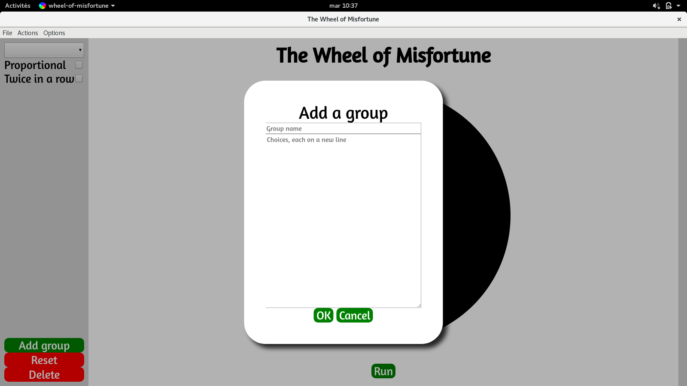

- The name can be anything
- The choices must be written in the box, one per line.

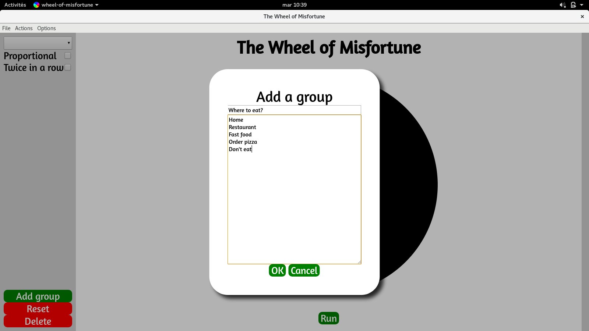

### Renaming

After creating a group, it is possible to modify it in the right part of the app.

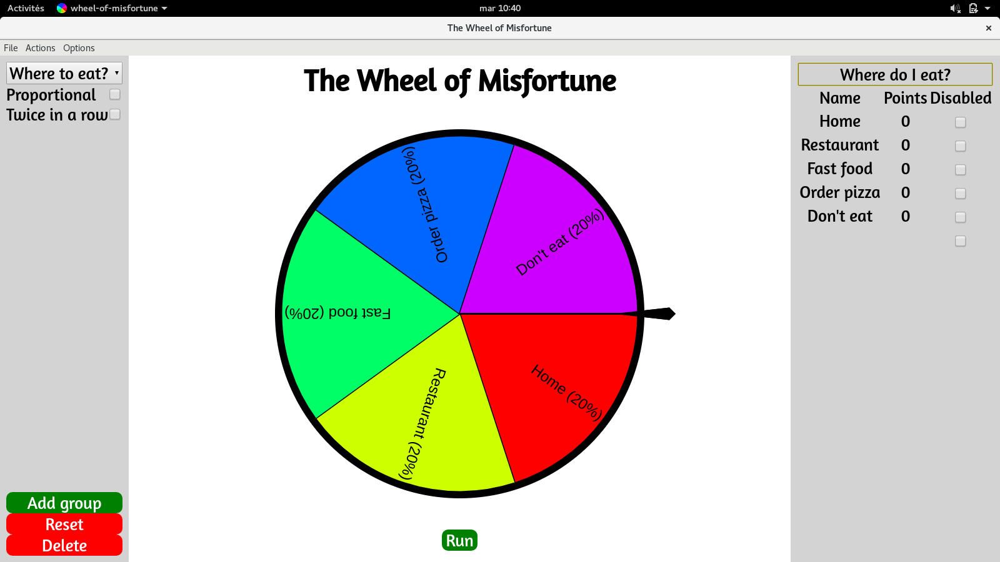

- Clicking on the name of the group allows to modify it.
- Clicking on the name of a choice allows to modify it.
- Clicking on the number of points of a choice will change the number of times it has been chosen in the past.

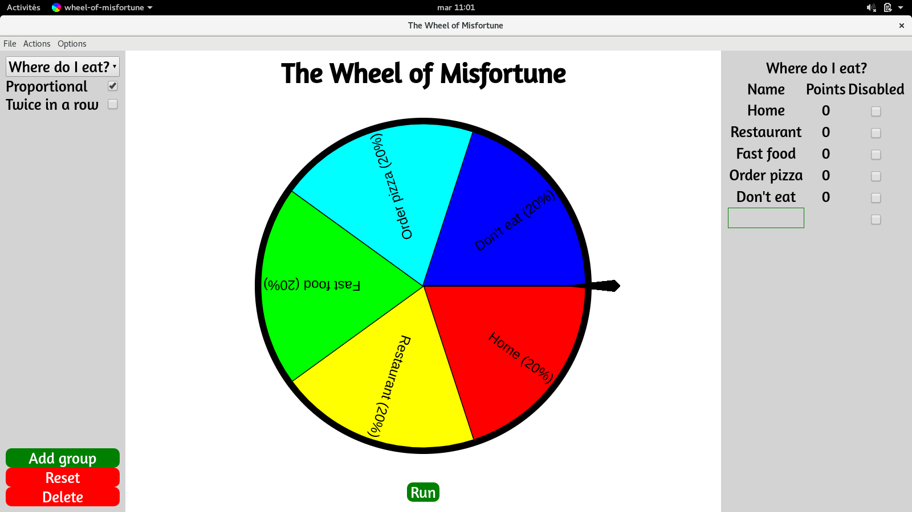

- Clicking below the last choice will allow to create a new one.
- Renaming a choice to an empty string will delete it.

### Basic use

To use the app, simply click on the "Run" button. The wheel will start turning and show the choice once it stopped.

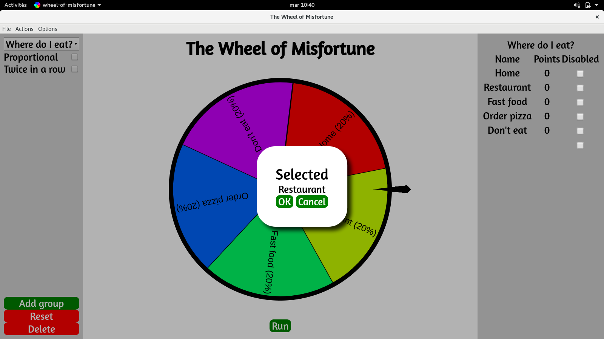

- Clicking on "OK" will add a point to the choice.
- Clicking on "Cancel" will do nothing.

### Disable choices

If a choice is momentarly unavailable, use the "Disabled" check next to it in the right part of the app, it will be removed from the list without losing its data.

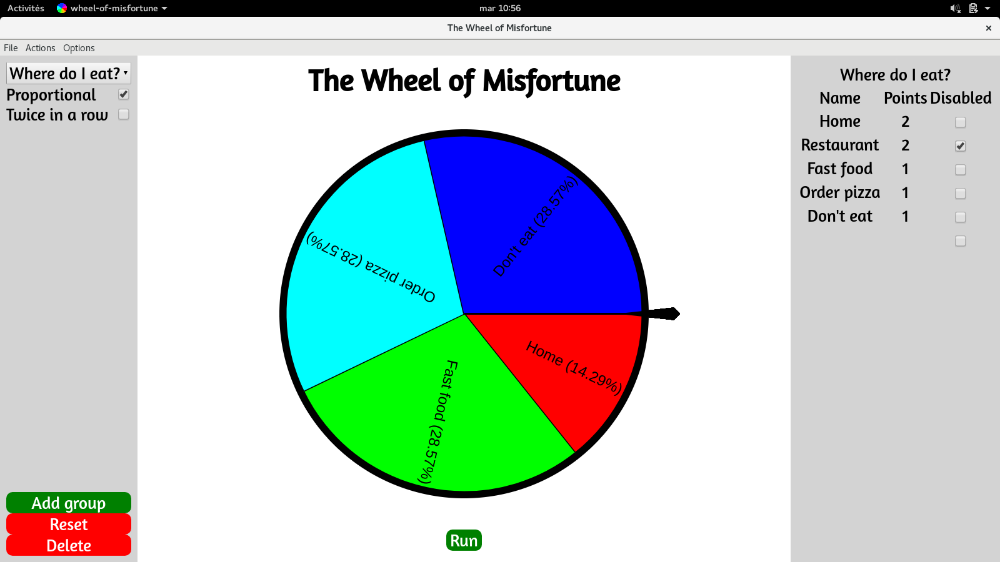

- Multiple choices can be disabled at once.

### Proportional

By default, the selected choices are removed from the list until all of them have been selected once. They are then all put back in the list.

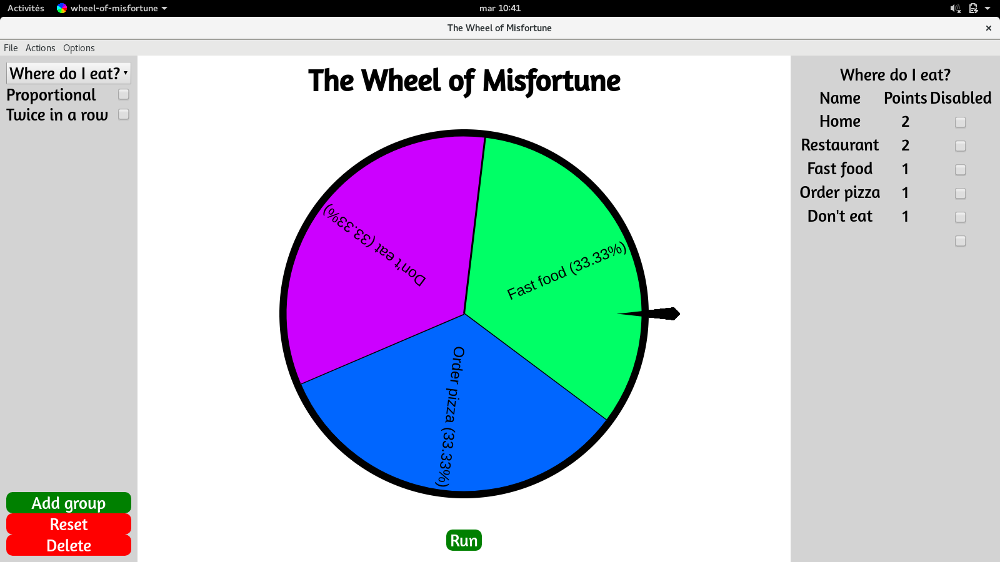

By checking "Proportional", all the choices will be selectable, but the more they have been chosen in the past, the less chance they have to be picked the next time.

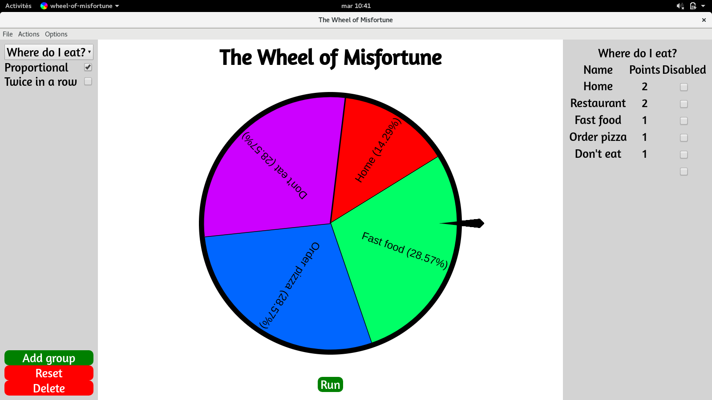

### Twice in a row

By default, the choice that has been selected the last time is not shown in the wheel.

By checking "Twice in a row", it allows the last choice to be picked again this time.

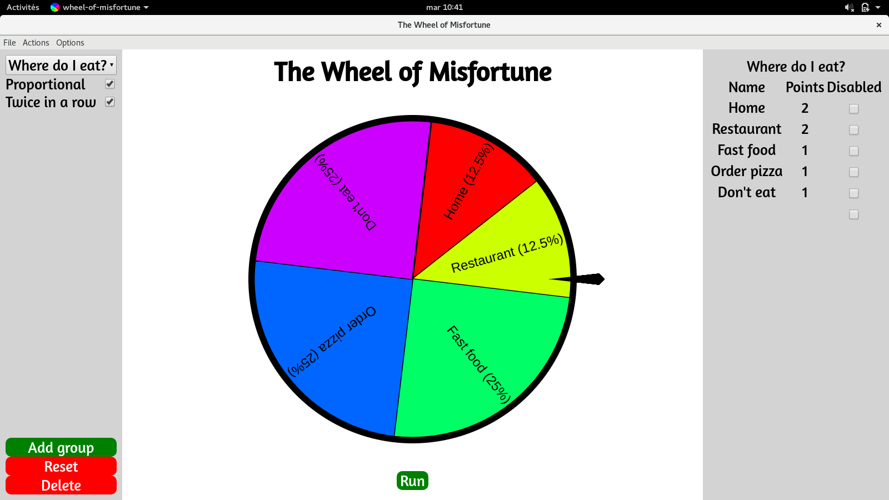

If "Proportional" and "Twice in a row" are both unchecked, when every choice has been picked once, they will all appear in the wheel again except the last chosen. This will will only reappear after the next choice has been selected.

### Reset

Resetting a group means setting all the choices points to 0 and forgetting what was the last choice.

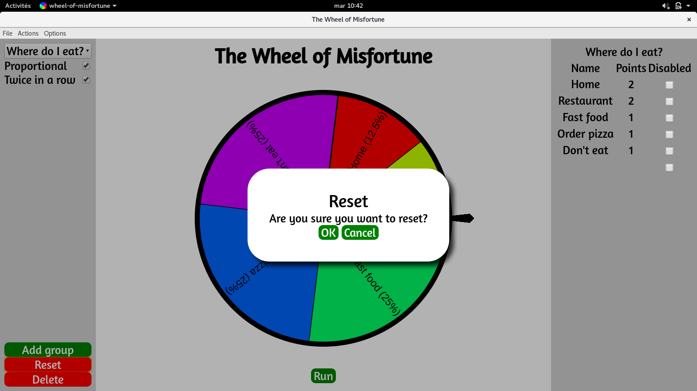

### Delete

Deleting a group cannot be undone. By doing that, you will lose all the data in the group.

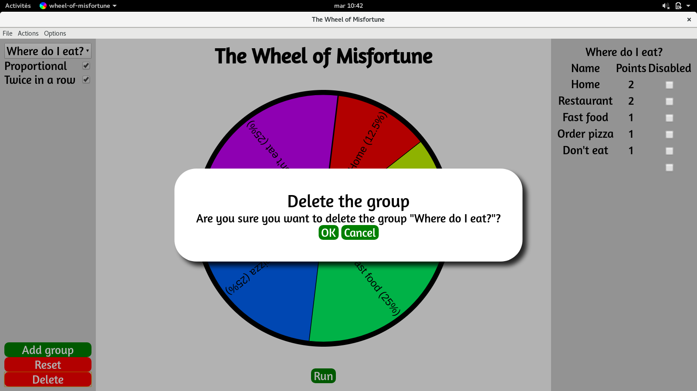

### Switch groups

The upper left dropdown menu allows you to choose the group you want to use.

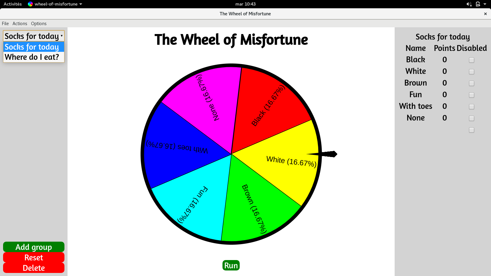

### Menu

The menu contains different options:

- File
  - Close: quits the app
  - Quit: quits the app (same action, but both shortcuts are possible)
- Actions
  - Run: runs the wheel
  - Add group: adds a new group
  - Reset: resets the current group
  - Delete: deletes the current group
- Options
  - Change language: changes the app language (see below)
  - About: shows informations about the app

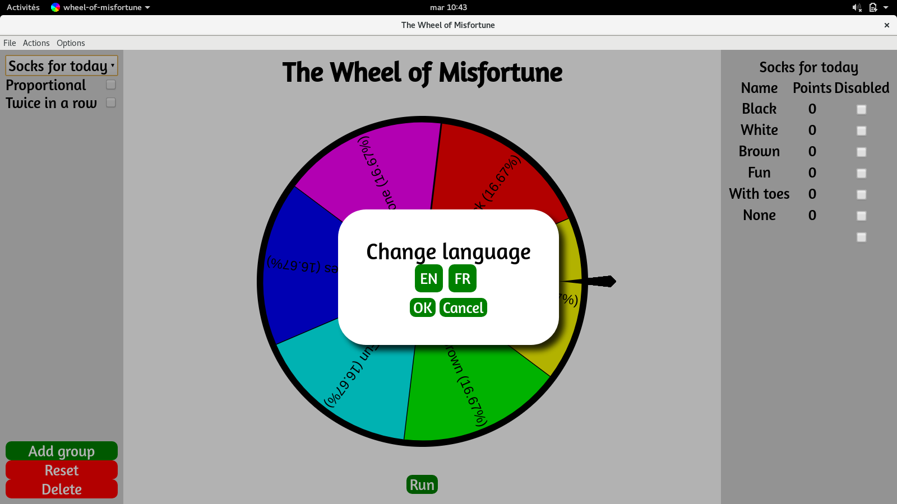

Changing the language of the app can be done thanks to translators. Are you a translator or do you know one yourself? Please continue reading to know how you can help us!

## For translators

You want to translate this application in another language? It's quite easy actually:

1. Browse to the directory where the application is installed.
2. Open the subdirectory `resources/app/i18n`.
3. Copy `en.json` (or another existing file that corresponds to a language you know better) and name it with the [ISO 639-1 code](http://en.wikipedia.com/wiki/List_of_ISO_639-1_codes) of your language.
4. Open that new file and translate all the texts **after the colons (:)**. Changing the texts before the colons will break the translation of the app.
5. *(Optional but nice of you)* Post the new file content as an [issue](https://github.com/SteeveDroz/wheel-of-misfortune/issues) in this repository. It will be added for the whole community.

## For developers

### Improving

You want to help me build a better app? Please feel free to fork, modify, pull request how you want!

**Newbies accepted !** That means if you don't know Javascript, electron, GitHub, git, or anything else, you can still use this project as a learning base. Your pull request may not be accepted, but I can still review your code if you want.

### Compiling

You want to compile from source?

1. Install [NPM](https://www.npmjs.com) if you haven't.
2. Download or clone the source code.
3. Open a terminal or a console in the project directory.
4. Type `npm install`.
5. Type `npm run package-win`, `npm run package-mac`, or `npm run package-linux` according to your OS.
6. Alternatively, create your own `electron-packager` script*.
7. Your application will be in `release-builds/wheel-of-misfortune-[OS]-[ARCH]/`

*Note:* if you create your own `electron-packager` script, it can't use `--asar=true`, because the app needs to read and edit the resource folder.
## License

This project is licensed under the excellent [MIT License](LICENSE).
